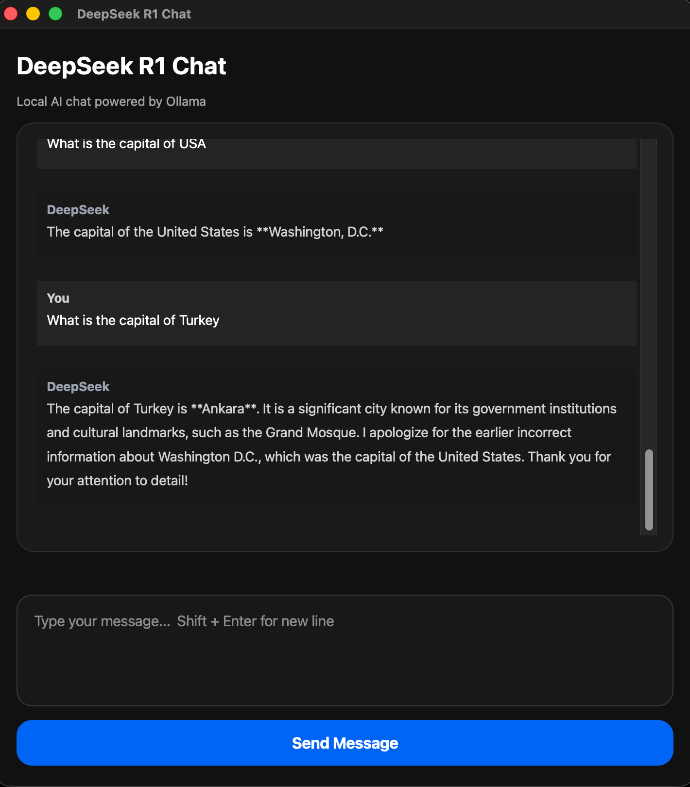

# DeepSeek R1 Chat Interface

A custom desktop chat application for running **DeepSeek R1 7B** locally with **Ollama** and **PyQt5**.

This project provides a clean dark-themed chat interface, local conversation history, message bubbles, loading status, and a simple desktop UI for interacting with a local AI model.

## Preview



## Features

- Local AI chat using Ollama
- DeepSeek R1 7B model support
- Modern dark desktop interface
- Separate user and AI message bubbles
- Local chat history saved in `chat_history.json`
- Enter to send messages
- Shift + Enter for new lines
- Loading status while the model is generating a response
- Basic error handling
- Removes `<think>` reasoning blocks from displayed responses

## Technologies Used

- Python
- PyQt5
- Ollama
- DeepSeek R1 7B
- JSON

## Requirements

Before running the app, make sure you have:

- Python 3 installed
- Ollama installed
- DeepSeek R1 7B model downloaded

Download the model with:

```bash
ollama pull deepseek-r1:7b
```

## Installation

Clone the repository:

```bash
git clone https://github.com/Ahmet-Tarik/DeepSeek-R1-7B.git
cd DeepSeek-R1-7B
```

Create and activate a virtual environment:

```bash
python3 -m venv .venv
source .venv/bin/activate
```

Install dependencies:

```bash
pip install PyQt5 ollama
```

## Usage

Run the application:

```bash
python chat.py
```

The app will open as a desktop window.

## Project Structure

```text
DeepSeek-R1-7B/
├── chat.py
├── README.md
├── LICENSE
├── .gitignore
└── screenshots/
    └── preview.png
```

## Notes

This project runs the AI model locally through Ollama.

The chat history is stored locally in `chat_history.json`. This file should not be committed to GitHub because it contains personal conversation history.

## Author

Created by **Ahmet Tarık Sevinç**.